## 1 AVL, Splay, Amortized Analysis

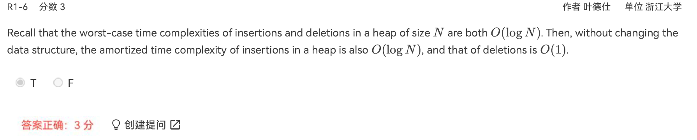

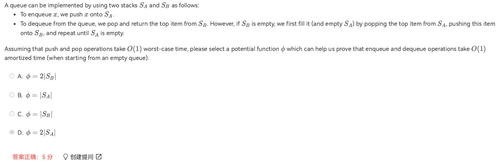

> - push，cost为1
> - pop，若B不为空，cost为1，若B为空，则cost为$2|S_A|+1$，因为需要把A中所有都从A中pop出来，push进B，因此选D，这样对每一个pop操作，$c_i+\phi_{i+1}-\phi_i$都一样

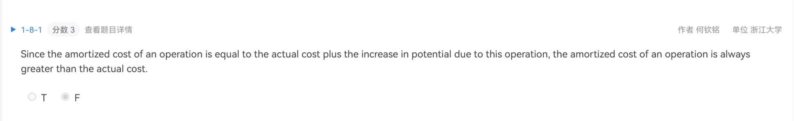

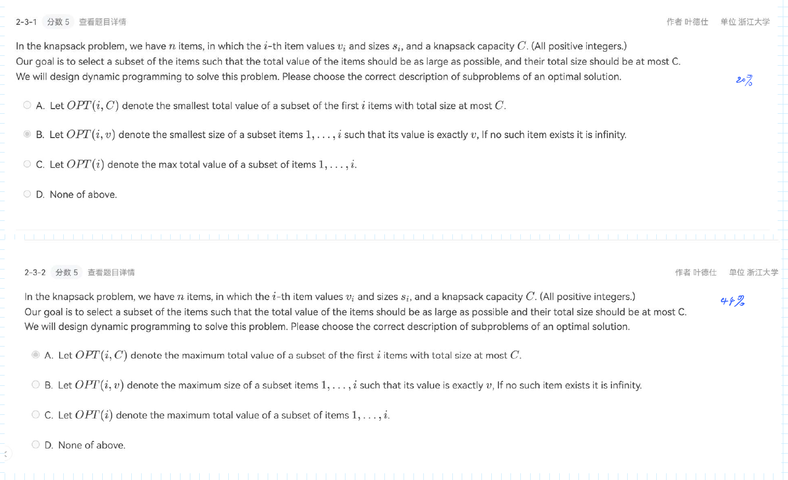

> 注意看选项，有细微区别

## 2 Red-Black Tree, B+ Tree

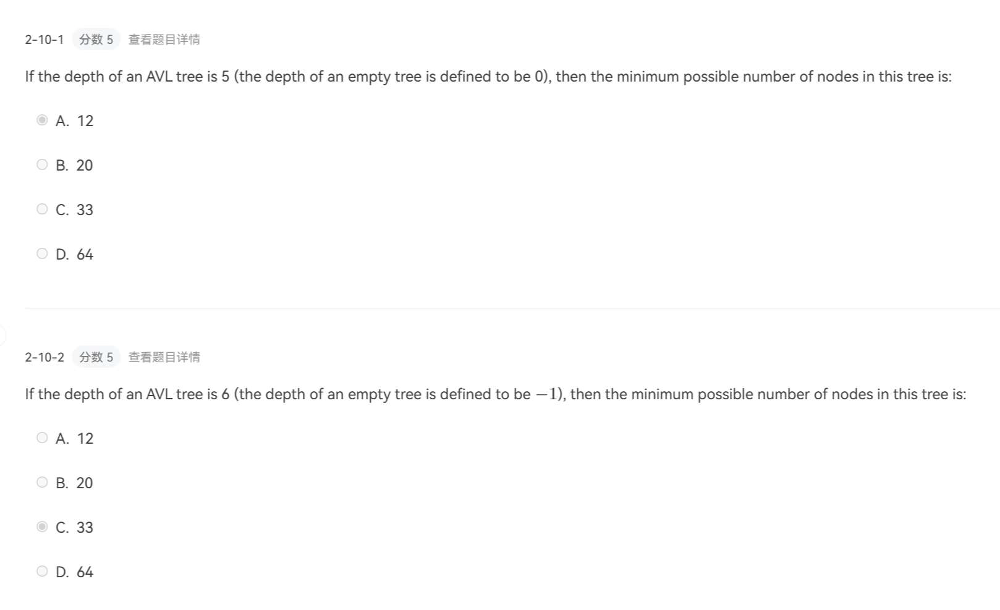

> 定义中$n_0=1$，因此empty应对应高度-1，在此基础才可以运用公式
>
> Fib: $F_0=0,F_1=1,F_2=1,F_3=2$

## 3 倒排索引

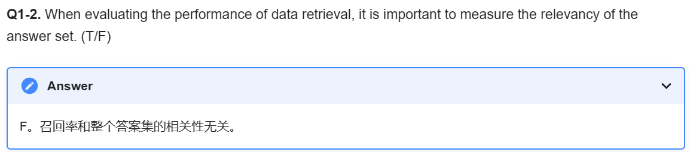

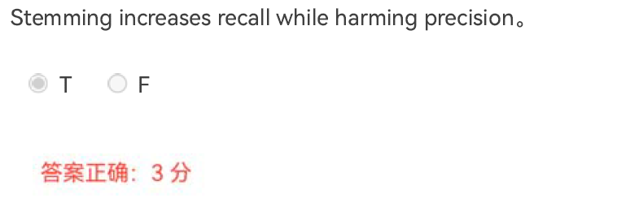

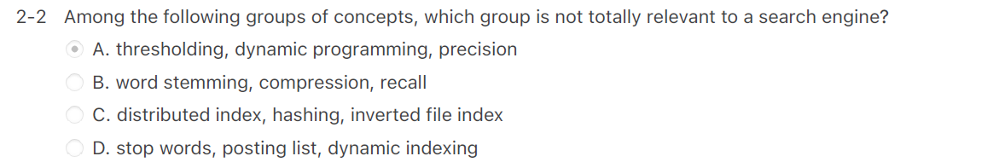

## 4 Leftist Heap, Skew Heap

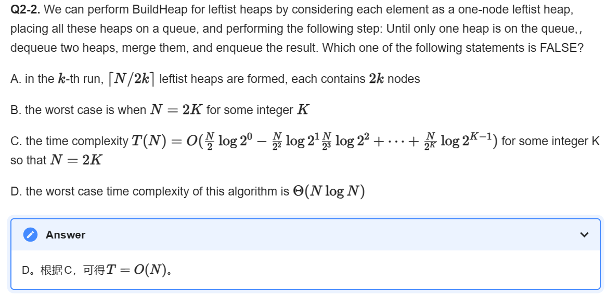

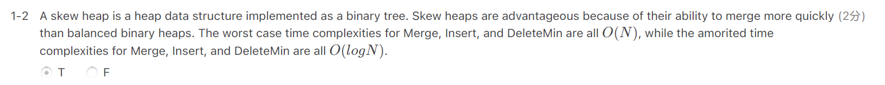

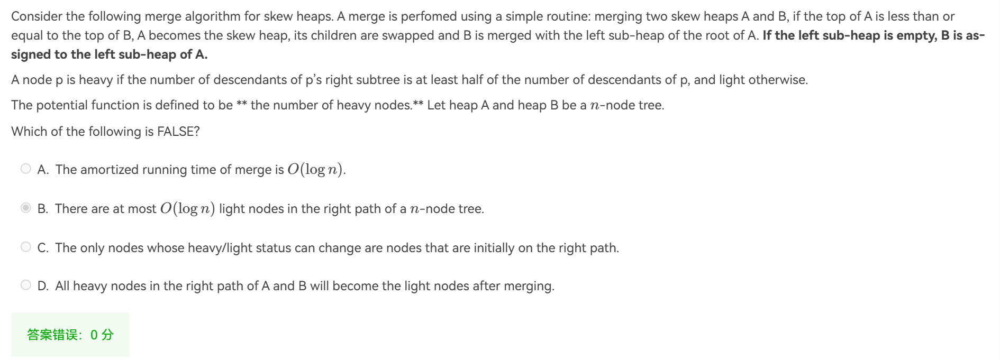

> 选D，看加粗部分

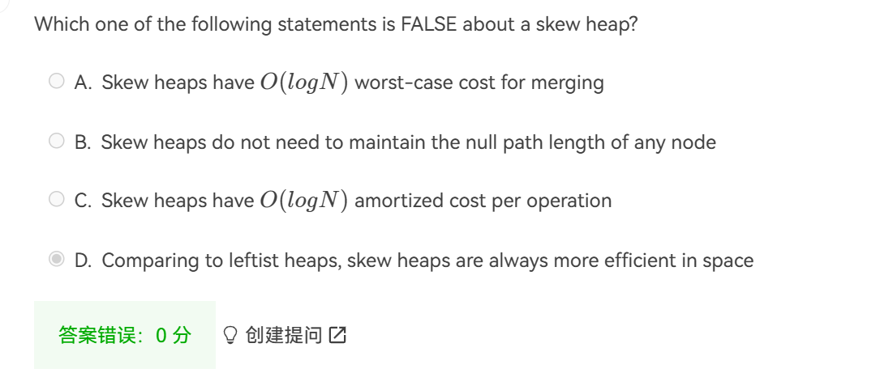

> A worst-case是$O(N)$

## 5 Binomial Queue

## 6 Backtracking

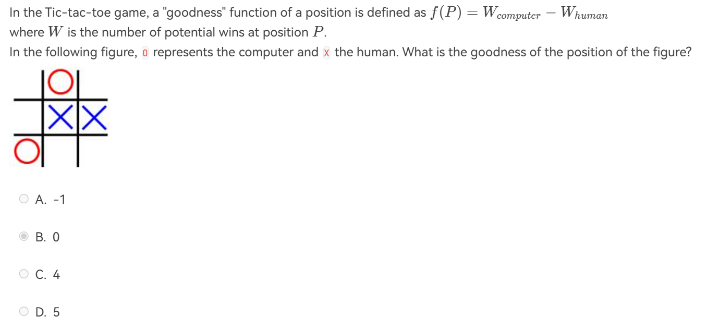

> **Answer**
>
> 考虑在当前情况下，两方能赢连线有几种
>
> 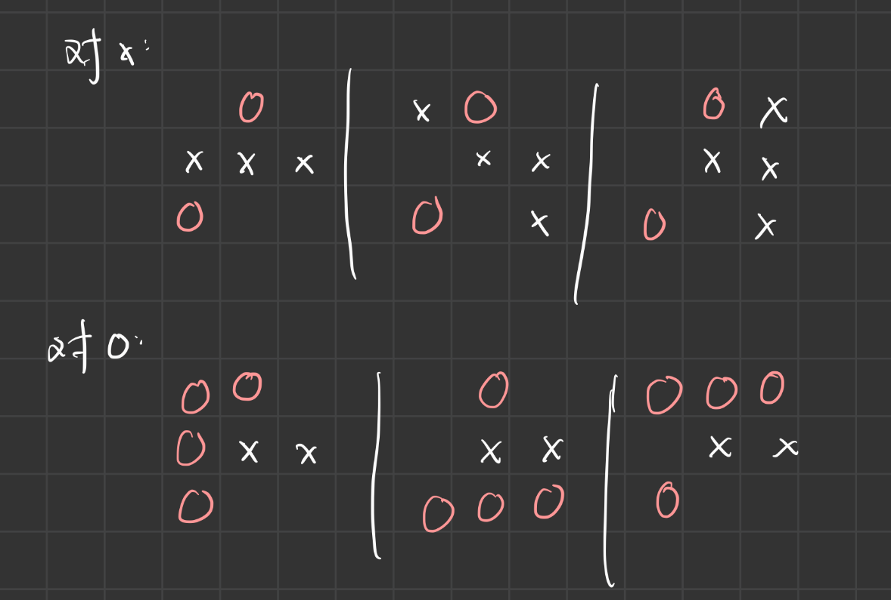
>
> 这里画出来的是最终情况下，若赢对应赢的方式，因此3-3=0

## 7 分治

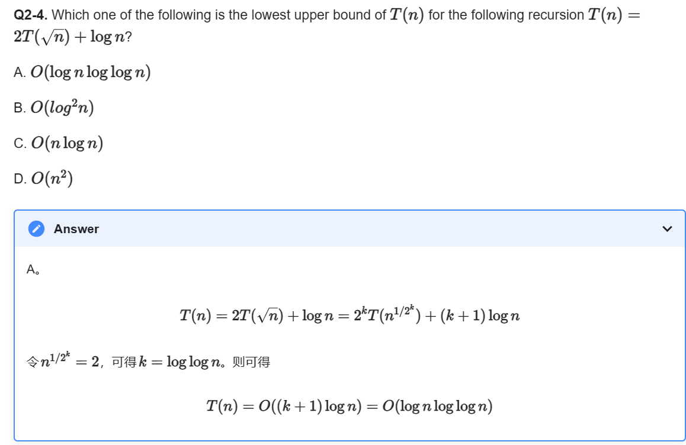

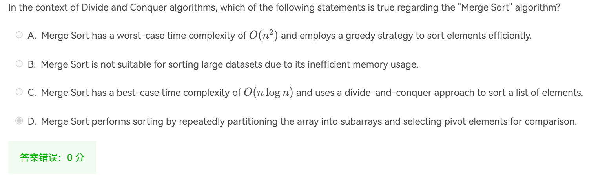

## 8 Dynamic Programming

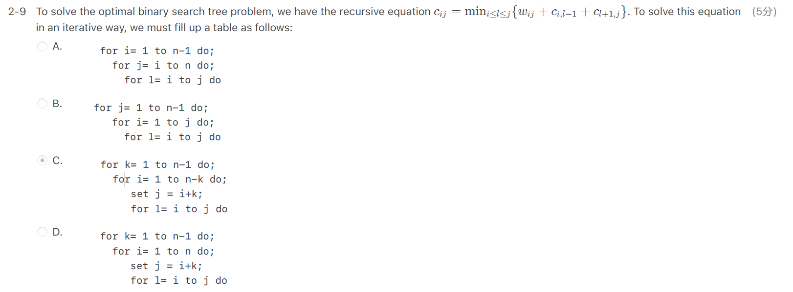

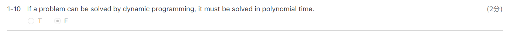

## 10 P & NP

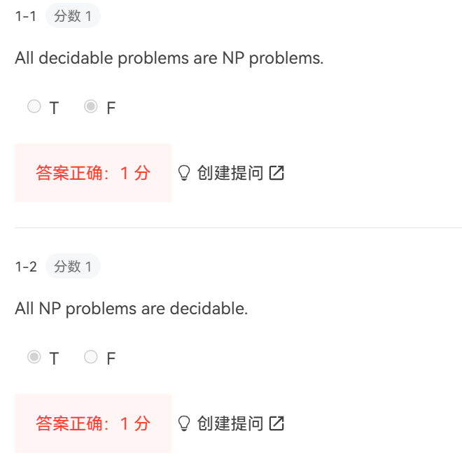

## 12 Local Search

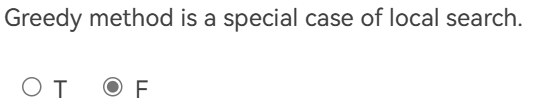

Greedy是不断前进，最后达到解。而local search是不断修改值，选择一个最佳的解。求出的每一个解都是最终的解。