# Chapter 2 Combinational Logic Circuits

1. 上侧 为 PMOS 管，常闭开关；下侧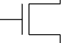为 NMOS 管，常开开关

   CMOS：抗噪声性质好，低静态能耗，但生产过程复杂

   组成：

   特点：gs 间电压高于阈值关闭，低于时打开

2. 一种可以独自实现所有布尔函数的门类型叫做通用门，与非门和或非门都是通用门
3. 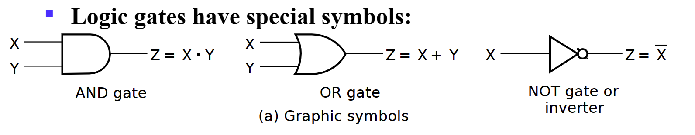
4. Gate Delay:
   - When input changes,the output change doesn't occur instantaneously.
   - the delay between an input changes and the resulting output change is the gate delay denoted by $$ t_G $$ s
5. Logic Diagrams and Expressions: Truth Table,Equation(逻辑函数),Diagram,波形图
6. Boolean Algebra:

- $$ X(Y+Z)=XY+XZ $$
- $X+YZ=(X+Y)(X+Z)$
  - Prf:

$$
A=A\cdot A=A\cdot (A+C)  \\
A+BC=A(A+B+C)+BC=(A+B)(A+C)
$$

- $\overline{X·Y}=\overline{X}+\overline{Y}$
- Absorption Theorem: $A+A·B=A,A+\overline{A}B=A+B$
- Consensus Law:
  - $(A+B)(\overline{A}+C)(B+C)=(A+B)(\overline{A}+C)$
  - $AB+\overline{A}C+BC=AB+\overline{A}C$  
    Hint： $BC=BC(A+\overline{A})$
- $\overline{X}Z+X=(X+\overline{X})(Z+X)=Z+X$  
  Hint: $X+YZ=(X+Y)(X+Z)$

7. 对偶（duality）式：把一个布尔等式中的所有与变或，或变与；若有 0，1 出现，则把 1 变 0，0 变 1；等式两端同时进行对偶操作，等式仍然成立。
   - 应用：求反函数时，可以先求对偶式，再将每一个字符求反
   - 除非一个表达式是**自对偶**，否则求对偶后都会变化
8. Precedence:

   - Parentheses
   - NOT
   - AND
   - OR

9. Examples:

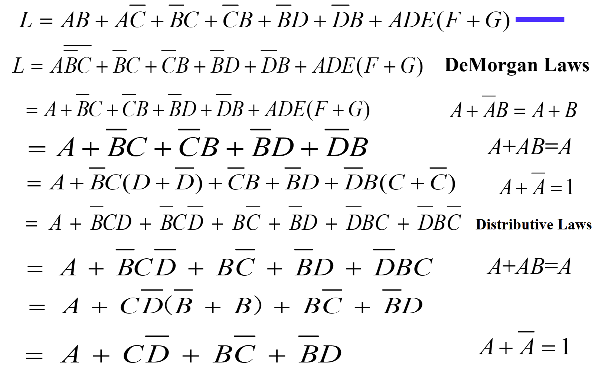

$$
F=\overline{\overline{AC+\overline{A}BC}+\overline{B}C+AB\overline{C}} \\
=(AC+\overline{A}BC)\overline{\overline{B}C}\cdot \overline{AB\overline{C}}\\
=C(A+\overline{A}B)(B+\overline{C})(\overline{A}+\overline{B}+C) \\
=C(A+\overline{A}B)(\overline{A}B+BC+\overline{A}\cdot\overline{C}+\overline{B}\cdot\overline{C}) \\
=C(A+\overline{A}B)(\overline{A}B+BC) \\
=ABC+\overline{A}BC=BC
$$

1.  

## Canonical Forms

1. minterm & maxterms: maxterm is complemented(取反) with minterm;
   
   
2. $\overline{m}_i=M_i,\overline{M}_i=m_i$
3. $F=\sum{m_i}=\overline{\prod{M_i}},i=0,1,2,3,\dots,2^n-1$
4. usage:turn logic function into numbers by minterm

## Standard Forms

1. SOP: an OR of AND terms,POS: an AND of OR terms

## Gate Input Cost

文字成本：等式字符个数

1. the number of inputs to the gates in the implementation corresponding exactly to the given equation or equations.
2. G - inverters not counted
3. GN - inverters counted
4. For SOP and POS equations, it can be found from the equation(s) by finding the sum of:

- all literal appearances（Literal cost,L:公式中一共出现的变量个数，可重复）
- the number of terms excluding single literal terms,(G) and 除单个文字之外的全部项数
- optionally, the number of distinct complemented single literals (GN) 计算非门.

## Karnaugh Maps

相邻的只有一位不同，Gray 码顺序

三变量图可以理解为圈，即最左侧和最右侧相邻
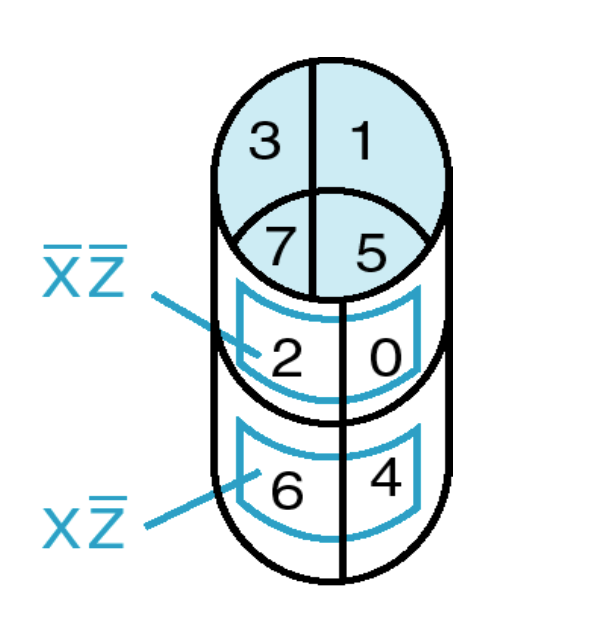

1. 消除：Karnaugh 图中有两个相邻小格子则可以删除一个变量

2. 四变量：

   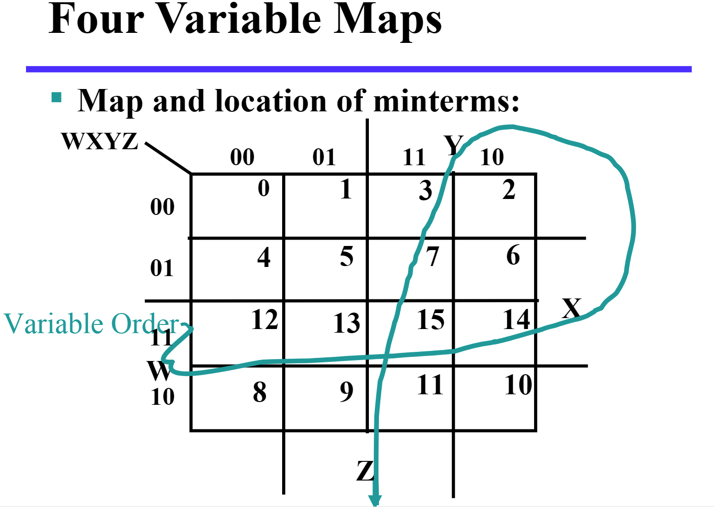

3. 蕴含项 Implicant: map 中的每⼀个格⼦, ⼀共$2^n$个.
   质蕴含项 Prime Implicant: map 中相邻的质蕴含项组成的长宽均为 2 的幂次的最⼤矩阵(⽐如 1$\times$2, 2$\times$2, 1$\times$4).
   质主蕴含项 Essential Prime Implicant: 包含仅包含在他之中的蕴含项的质蕴含项.(就是少了这个质蕴含项, 其他的
   质蕴含项全⽤上也少了格⼦).

4. 无关项$\times$：仅作为圈选矩阵时的桥梁，不需要考虑是否有遗漏

## Buffer

仅作为放大器，放大输入信号后输出，同时可以提高电路运行速度，但有 cost

1. A buffer is a gate with the function F=X
2. the same as a connection
3. used to improve circuit voltage levels and increase the speed of circuit operation
4. 例题：以下哪种情况需要 buffer

ans：1 不需要，否则 cost 超；2 需要；3 不相关，不能同时满足 delay 和 cost 的约束

5. Constraints on cost and performance have a major role in making tradeoffs

## NAND Gates

自然搭建速度最快的门

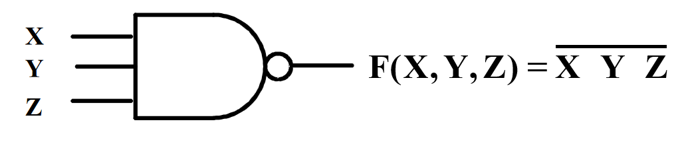

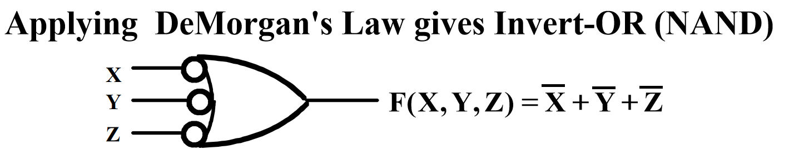

1. This NAND symbol is called Invert-OR, since inputs are inverted and then ORed together.
2. AND-Invert and Invert-OR both represent the NAND gate. Having both makes visualization of circuit function easier.
3. NOR 没有一个定义的数学符号，因为 NOR 操作是非关联的，难以数学描述

## Exclusive OR/ Exclusive NOR

1. The XOR function is: $X⊕Y=X\overline{Y}+\overline{X}Y$
2. The eXclusive NOR (XNOR) function, otherwise known as equivalence is: $\overline{X⊕Y}=XY+\overline{XY} $
3. $X⊕\overline{Y}= \overline{X⊕Y}$
4. $X⊕Y⊕Z=X⊕(Y⊕Z)$

## Odd and Even Functions

1. The 1s of an odd function correspond to minterms having an index with an odd number of 1s.
2. The 1s of an even function correspond to minterms having an index with an even number of 1s.
3. 奇函数取非即为偶函数

## 异或与奇函数

1. 多变量异或称为奇函数，如$X⊕Y⊕Z$，要求奇数个变量为 1 时输出为 1
2. 由此我们可以得到奇偶发生器和检验器
3. 三变量偶校验码生成器（上）与检验器（下）

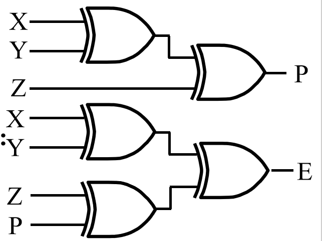

4. 异或搭建：

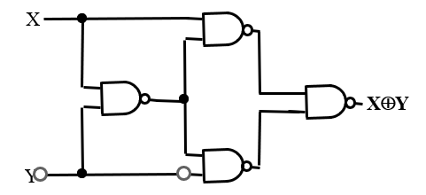

## 同或与偶函数

多变量同或被称为偶函数

观察多变量同或与异或的卡诺图，我们会发现它们是天然优化的，即不可优化的

## The 3-State Buffer

EN 为 0 时，不管输入什么，输出都是高阻态（开路，没有连接）

1. For the symbol and truth table, IN is the data input, and EN, the control input.
   For EN = 0, regardless of the value on IN (denoted by X), the output value is Hi-Z.
   For EN = 1, the output value follows the input value.

   

   2. 两个三态门输出相连时：当两边 EN 不同时, 输出为 EN 为 1 的输出值; 当两边 EN 都是 0 时输出⾼阻, 当两边 EN 都是 1 时, 不被允许.

   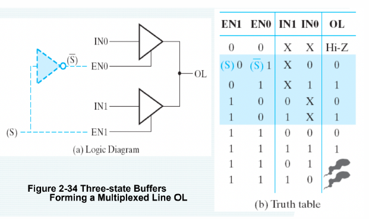

   3. 至少有一个 buffer 输出为高阻态，否则会导致 high currents，破坏电路。因此只有以下五种输入允许。

   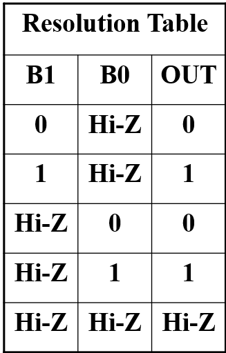

   对 n 个三态门，至少 n-1 个输出应为高阻态，此时有效输入一共有$2n+1$种

## 3-State Logic Circuit

1. Data Selection Function: If s = 0, OL = IN0, else OL = IN1

2. Performing data selection with 3-state buffers:

3. Since EN0 = S and EN1 = S, one of the two buffer outputs is always Hi-Z plus the last row of the table never occurs.

   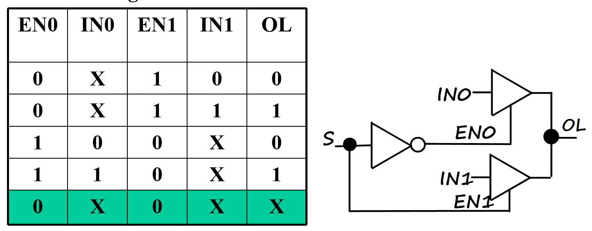

## Transmission Gates

用来连接和断开电路中两点的门

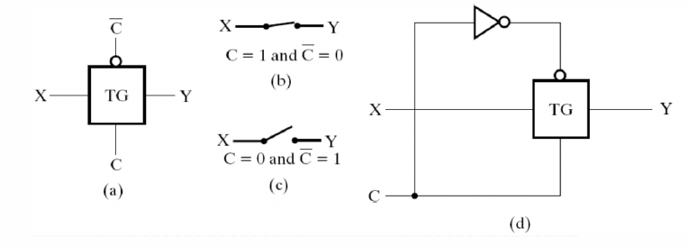

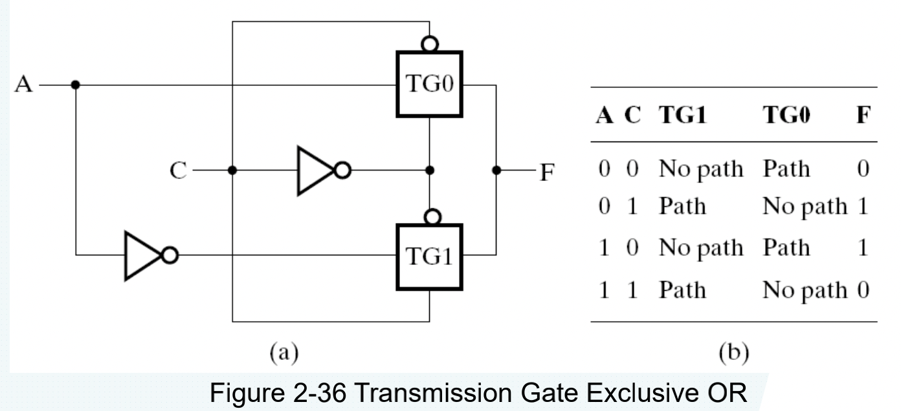

## 门传输延迟

1. $t_{pd},t_{PHL},t_{PLH}$
2. 惯性延迟：当输入使得输出在低于拒绝时间的间隔内发生两次变化，那么输出将不发生变化
3. 门有求反操作时，HL 输入电压变化导致输出产生 LH 变化，不求反时输出也为 HL 变化

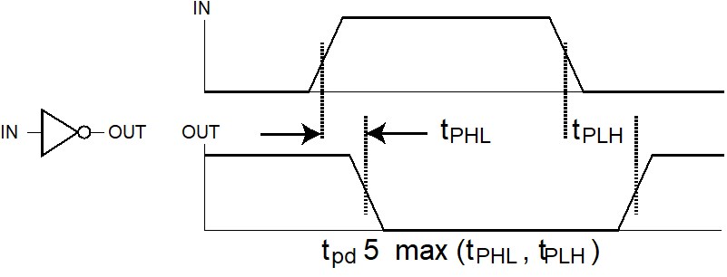

