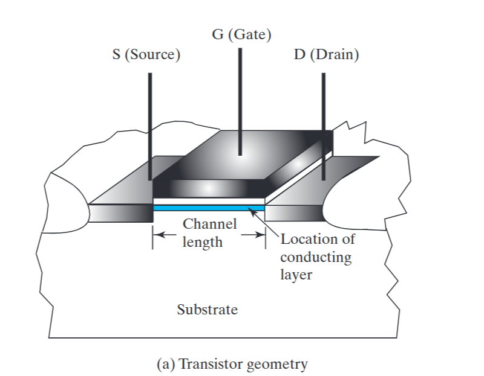
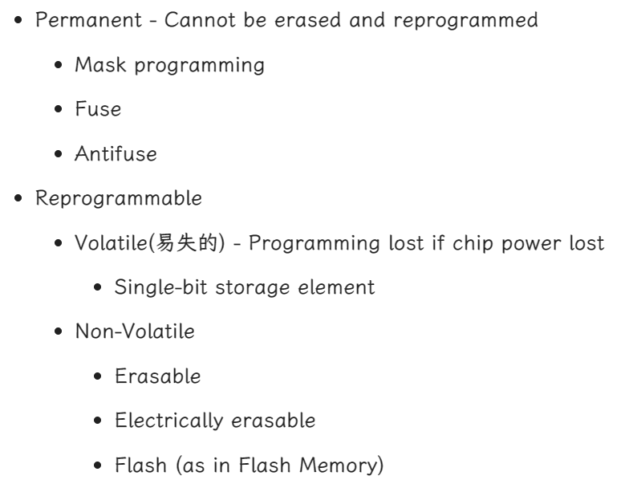
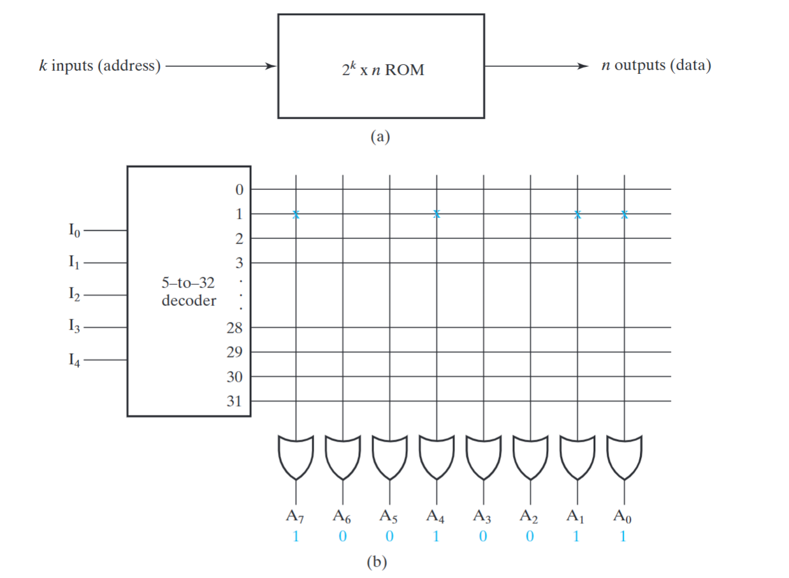
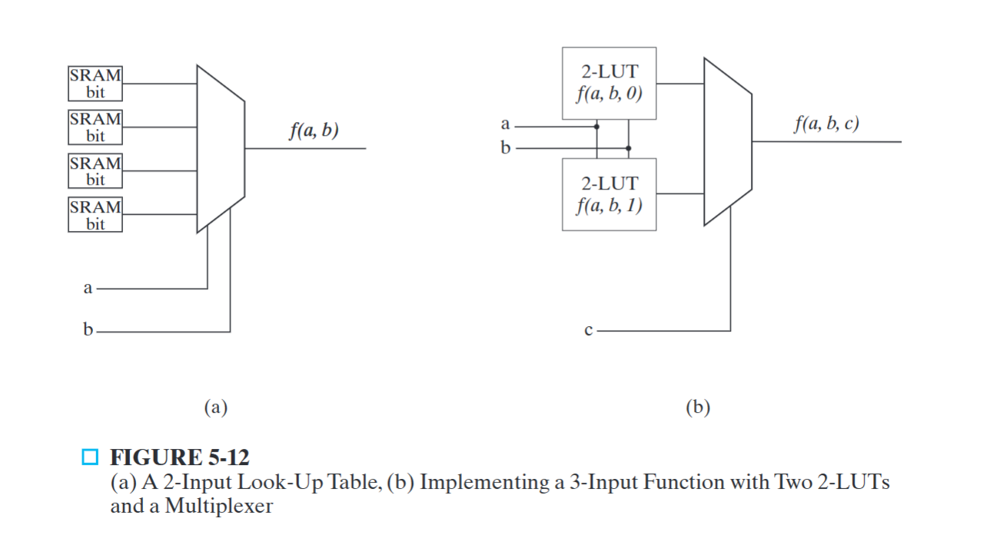

# Chapter 5 Digital Hardware Implementation

## CMOS 

CMOS基础是MOS（金属氧化物半导体）晶体管

漏极电压比源极电压足够大，处于导通状态（ON）；小于阈值，沟道消失，处于截止状态（OFF）

## Why Programmable Logic?

1. Facts:
   - It is most economical to produce an IC in large volumes
   - Many designs required only small volumes of ICs

2. Need an IC that can be:
   - Produced in large volumes
   - Handle many designs required in small volumes
3. A programmable logic part can be:
   - made in large volumes
   - programmed to implement large numbers of different low-volume designs
4. Many programmable logic devices are field-programmable, i. e., can be programmed outside of the manufacturing environment
5. Most programmable logic devices are erasable and reprogrammable.
   - Allows “updating” a device or correction of errors
   - Allows reuse the device for a different design - the ultimate in re-usability!
     Ideal for course laboratories

6. Programmable logic devices can be used to prototype design that will be implemented for sale in regular ICs.
   - Complete Intel Pentium designs were actually prototyped with specialized systems based on large numbers of VLSI programmable devices!

## Programming Technologies

### Classification

#### Control connection

1. Mask programming：工厂生产时完成，不可再编程，好处是成本低，one time programming
2. Fuse(熔丝)：在芯片设计时，在很多芯片引脚连接之间有 fuse, 设计电路时不需要保留连接的用高电压产生高电流，熔断 fuse.
3. Antifuse 反熔丝：最开始断开，击穿后电路连接好
4. Single-bit storage element：存储一个二进制位，这个位的输出控制一个晶体管，进而控制两个引脚连接/断开
   1. 用一位存储单元驱动一个n沟道MOS晶体管
      - 存储1晶体管导通，0则截止
   2. 供电时才能存储值，因此是易失的

5. 晶体管开关控制：基于浮动栅极存储电荷，浮动栅极存储的负电荷使晶体管截止。若正常栅极加载高电平，存储负电荷消失使晶体管导通

#### Build Lookup Table(LUT)

如 16 位寄存器（存真值表的值） +16-1 Mux 可构成四输入之内的逻辑模块，只需要将 16位寄存器填上不同的值就可以实现不同的逻辑函数

#### Transistor Switching Control

1. 用晶体管控制开关，类似连接控制
   浮动栅极：

2. Stored charge on a floating transistor gate

   - Erasable 擦除：用强紫外线照射足够长时间
   - Electrically erasable 电擦除：用高于正常值电压擦除
   - Flash (as in Flash Memory) 可以擦除指定若干个浮动栅极存储的电荷

   Storage elements(as in a memory)

### Characteristic

### Configuration

1. **ROM(Read Only Memory)**：a fixed array of AND gates and a programmable array of OR gates 固定与阵列，可编程或阵列

- 非易失性

- ROM size=address width × word width = $2^2 ×4$= 16 bit

    

2. **Programmable Array Logic (PAL)** - a programmable array of AND gates feeding a fixed array of OR gates.

输出侧或门阵列固定，输入侧与门阵列可编程

缺点：输入数量有限，不一定能够完备表达函数

改进：通过将一个既有的 PAL 输出当作输入，输入到另外一个函数中，来弥补项不足的问题。

3. **Programmable Logic Array (PLA)** - a programmable array of AND gates feeding a programmable array of OR gates.

1. - 可编程与阵列输入，可编程或阵列输出
   - 与 PAL 的区别在于，在输出的时候也能对输出组合进行重编程。
   - 其同 PAL 一样具有一个缺陷是，因为表达函数的方法不是通过 SOM 或者 POM 的形式，所以不一定能够完备表达函数。输入
   - 在基础上一个改进是在输出的时候再做一次异或（不用非门体现了可重编程的思想），以产生新的项，来弥补项不足的问题。异或门体现了可控求反。
   - 与项资源有限，需要找到可重用的与项。

2. 对一个n输入，k乘积项，m输出PLA
   - 在输入和与门阵列之间有$2n\times k$个可编程连接点，与门与或门之间有$k\times m$个，或门与异或门之间有m个

## FPGA

1. 包括可编程逻辑块、可编程互联和可编程输入/输出引脚。
2. FPGA可以配置组合逻辑和触发器，大多使用SRAM进行配置
3. 可编程逻辑块包括组合和时序逻辑，基于查找表（Look-Up List），一个查找表是一个$2^k\times1$存储器

