# Chapter 6 

# Registers & Register Transfers

## Register

### 保持信号在多个时钟周期不变

添加Load，Load为0时无论clock为何值，输出不变，Load为1时，输出随clock变化

1. 方式一：直接加或门

然而，在门控时钟技术中，由于添加了一个额外的逻辑门，时钟脉冲到达 Control 的时候会出现额外的传播延时，即时钟偏移(clock skew)。而这微小的延时会导致在整个同步系统中，不同组件得到的时钟脉冲有偏差，而这是我们所不希望看到的。所以在实际设计中，我们应当避免或尽可能缩小时钟偏移。

2. 另外一个做法是，在不希望它修改的时候，不断将它的输入载入，也就是保持不变。我们可以通过一个二选一多路复用器实现。

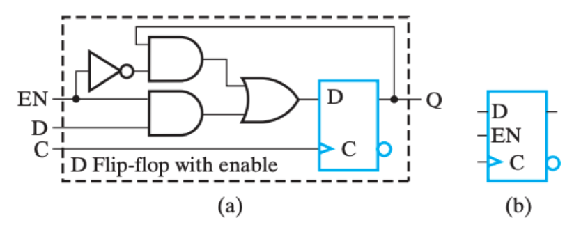

## Register Cell Design

Assume that a register consists of identical cells.(每个位执行相同操作)

- Design representative cell for the register
- Connect copies of the cell together to form the register
- Applying appropriate *"boundary conditions"* to cells that need to be different and contract if appropriate

#### Specifications

- A register
- Data inputs to the register
- Control input combinations to the register
  *e.g.* 控制输入: Load, Shift, Add. 我们可以用三个引脚分别表示控制输入(not encoded, one-hot code)，也可以用两个引脚 S0 S1 的组合来表示控制输入(encoded)
- A set of register functions (typically specified as register transfers) 即规定控制输入的函数是对数据进行什么样的操作
- A hold state specification(*e.g.* If all control inputs are 0, hold the current register state)

## Register Transfer Operations

 The movement and processing of data stored in registers

- Three basic components:
  - set of registers(源寄存器，目标寄存器)
  - operations
  - control of operations 监督操作序列的控制
- Elementary Operations -- load, count, shift, add, bitwise "OR", etc.
  Elementary operations called micro-operations

其中，最基础的那部分操作被称为微操作(micro-operation)，它们是实现复杂操作的基础，例如将 R1 的数据载入 R2，将 R1 和 R2 相加，或是自增 R1 等。它们通常以比特向量为载体并行实现的。

### Register Notation

RTL:**寄存器传输语言(Register Transfer Language)**

1. $sl,sr$例子： R2<-sl R1 ，R1左移一位传给R2

2. example:如果 K1=1 那么将 R1 的信号传给 R2, 我们可以写为 K1:(R2←R1), 其中 R1 是一个控制变量，表明条件执行的发生是否发生。K1控制的是R2是否接收R1的信号，而非R1是否发送

### Register Transfer Structures

### 1. Multiplexer-Based Transfers：基于多路复用器的传输

$K1:R0\leftarrow R1,K2\overline{K1}:R0\leftarrow R2 $,也就是$K1+K2$为真时R0会被更新

通过一系列one-hot编码决定选择哪个，其中 `MUX` 的 *k*∼(*n*−1) 实现了**[转移](https://note.isshikih.top/cour_note/D2QD_DigitalDesign/Chap06/#转移)**操作。

### 2. Multiplexer Bus 

### 	基于专用多路复用器的传输

### 	基于共用多路复用器的传输

​	通过总线bus实现n选1多路复用器完成寄存器之间值的交换。门输入成本9/bit，多路复用器8个输入+1个输出

### 3. Three-State Bus 三态总线

The 3-input MUX can be replaced by a 3-state node (bus) and 3-state buffers. Cost is further reduced, but transfers are limited.

只有一个三态门被使能时，也就是只有一个三态门不处于高阻态。电路中所有都是该值。

减少接线，降低布线难度。

将寄存器和三态门封装在一起考虑，那么我们只需要一个外部引脚(n bits), 但多路复用器的方法需要两根位宽是 n 的引脚（因为三态门的外部引脚是可以双向传输数据的）

门输入成本：9（$3\times3$个三态门）

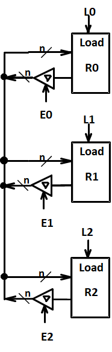

### Shift Registers

使用触发器而不能使用锁存器（除极少特例）

1. 右移

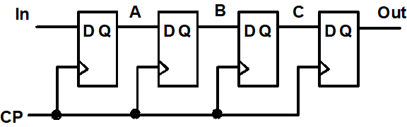

2. 右移+并行输入 Parallel Load Shift Registers
   - shift=0 并行输入
   - shift=1 移位

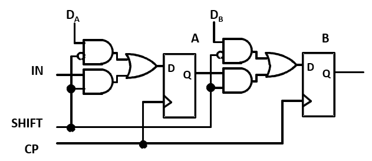

- Shift为1，移位
- Shift为0，Load0，保持
- Shift为0，Load1，并行加载

### 双向位移寄存器（通过加入一个多路选择器实现）

对$S_1S_0$,00保持，01左移，10右移，11并行输入

其本质上就是添加了一个 MUX 来选择下一个时钟是继承 $(i+1)、(i-1)、D_i$还是$Q$

## Counters

### Ripple Counter

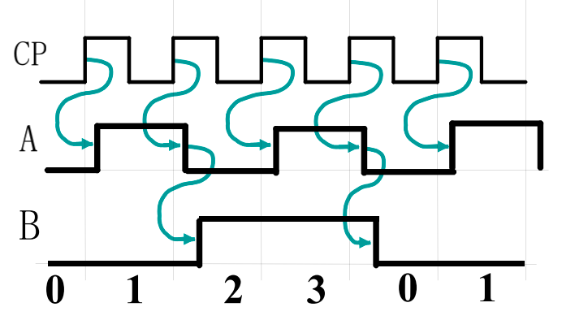

1. B频率是A一半。A输出取反作为B的时钟信号。 可以用做时钟分频。

2. 上图中，下一个 FF 的时钟来自于上一个 FF 的输出取反，也就是对于上升沿触发的 FF 来说，下一个 FF 会在上一个 FF 的输出从 1 到 0 时自反，所以是正向计时(Upward Counting)；
   反之，如果下一个 FF 的时钟来自于上一个 FF 的直接输出，也就是对于上升沿触发的 FF 来说，下一个 FF 会在上一个 FF 的输出从 0 到 1 时自反，所以是逆向输出(Downward Counting)；
3. 缺点：每一个时钟信号传递都有延时，同时不能作为同步计数器。简单但不安全。

理论上，111之后应该变成000，但实际上：$111->110->100->000$

此外对于n bits, 最坏时间延迟是 $n\cdot t_{PHL}$ 速度会非常慢.

4. 使用：越高级的触发器越不容易被触发，功耗低，可用于脉冲计数等场景。

### **Synchronous Counters** 同步计数器

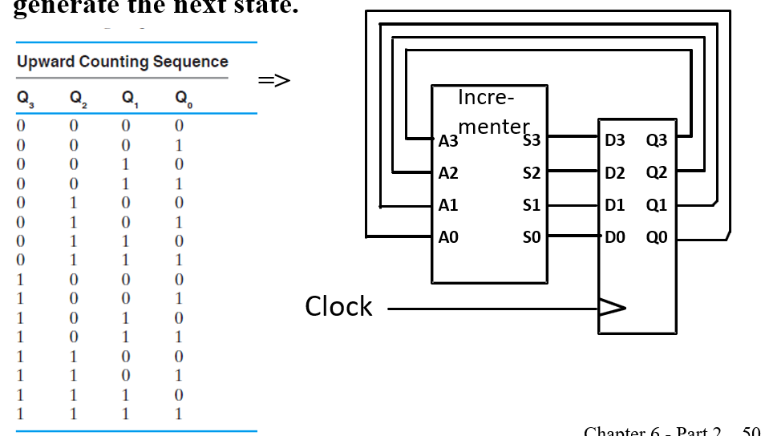

每次通过自增器+1

观察发现，位数增加时不利于化简，但$Q_n$取反当且仅当0~n-1均为1，因此可以采取以下与门链作为控制信号

使能为0相当于保持。 CO输出进位用于下一部分电路

问题：同样存在延迟。 

解决方法：look ahead 用一个与门把所有低位接起来

symbol：

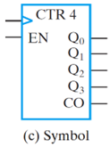

### Other Counters

1. Down Counter
2. Up-Down Counter
3. Parallel Load Counter
4. Divide-by-n(Module n) Counter：十进制模9，时钟模5

### Counter with Parallel Load

实现并行输入

### **Design Example: Synchronous BCD**

1. 状态表：

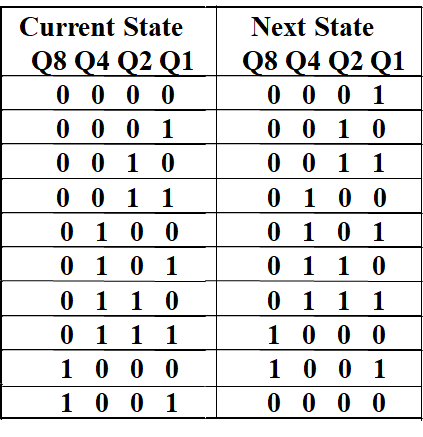

2. 卡诺图化简

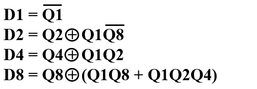

3. 验证无用状态情况，发现不会死锁

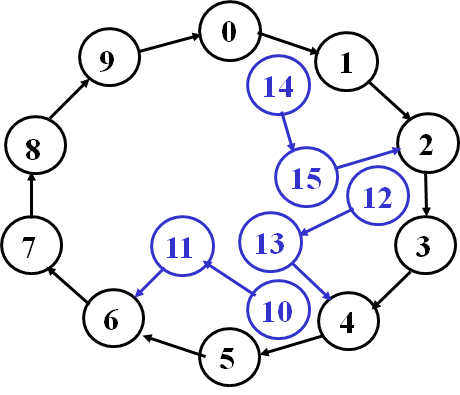

### Counting Modulo N

1. 二进制计数器基础上，采取同步/异步清零

- 异步，通过clear（异步复位脚），计数达到N实时清零即可

- 同步，N-1时reset为1，在下一个上升沿清零 `better choice`

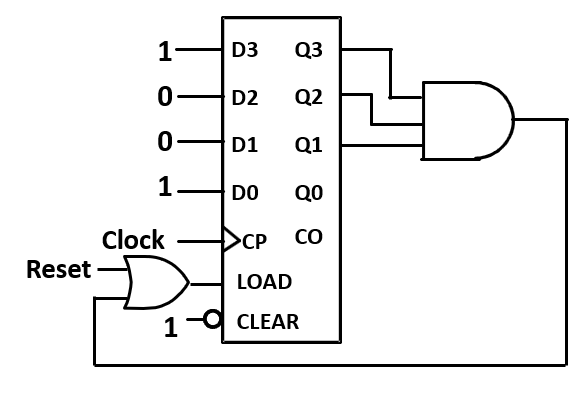

2. 多位寄存器，分开设计，如设计时间，低位为模 10 计数器，高位为模 6 计时器，低位的 `Carry Output` 既作为低位的同步清零信号，又是高位的 `Enable` 信号.

## Serial Operations

串行：寄存器一次只接受一个二进制位，如果传输 n 位需要 n 个时钟周期。

需要的引线数量少，两个设备之间只需要一条线和一条地线就可以了。而且因为引线少，我们可以让其时钟频率达到非常高

当今高速传输如USB，以太网线等都使用串行

串行加法器：仅使用一位全加器与一个用于进位的触发器。The result is stored in the A register and the final carry in the flip-flop

Serial addition is a low cost way to add large numbers of operands, since a “tree” of full adder cells can be made to any depth, and each new level doubles the number of operands.

Other operations can be performed serially as well, such as parity generation/checking or more complex error-check codes.

Shifting a binary number left is equivalent to multiplying by 2.  Shifting a binary number right is equivalent to dividing by 2.