# Chapter 7  Memory Basics

## Memory Definition

1. 内存：存储单元的集合，以及向它们传输信息和从它们传输信息的必要电路
2. 内存组织：内存的基本架构结构，以访问数据的方式表示
3.  随机存取存储器 （RAM）： 一种组织起来的存储器，可以在不依赖于所选特定单元的时间内将数据传输到任何单元（或单元集合）或从任何单元（或单元集合）传输数据。 
4. 内存地址：标识特定内存元素（或元素集合）的位向量。

5. typical data elements
   1. bit: a single binary digit
   2. byte: eight bits accessed together 8bit一字节
   3. word: 二进制bit集合，大小通常是2的幂次个byte，不同计算机字长可能不同
6. memory data： 要存储到内存或从内存访问的内容
7. 内存操作：如读取写入等等

## Memory Organization

Organized as an indexed array of words. Value of the index for each word is the memory address.

### Memory Block Diagram

- $k$ address lines decoded to address $2^k$ words of memory
- each word is $n$ bits
- Read and Write are single control lines by 1 bit.

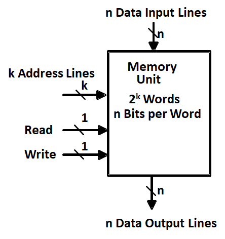

### Memory Organization Example

地址0-7，每个地址存8位数据

## Memory Operation Timing

通常是异步的

1. 读

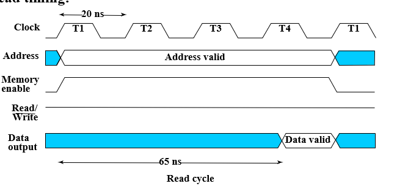

2. 写

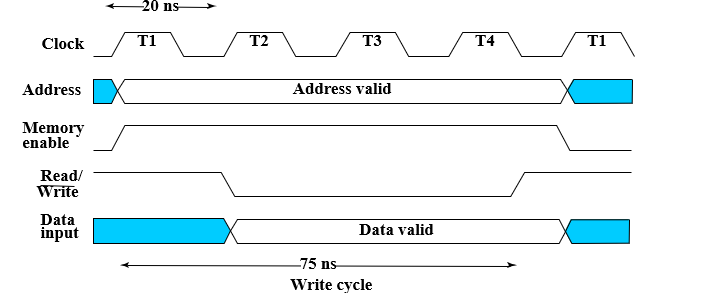

- Critical times measured with respect to edges of write pulse (1-0-1):
- Address must be established at least a specified time before 1-0 and held for at least a specified time after 0-1 to avoid disturbing stored contents of other addresses 地址应该在读写开始前和结束后都保持一定时间的稳定
- Data must be established at least a specified time before 0-1 and held for at least a specified time after 0-1 to write correctly 数据同理
- 读访问时间和写周期时间必须要为时钟周期的固定倍数，这是因为读写操作的起始和结束是通过是时钟边沿控制的
- 在读操作后，前65ns为读访问时间，此之后数据才完整有效

## RAM

1. type of random access memory： 
   1. static,SRAM：速度快，成本高，information stored in latches，断电丢失信息
   2. dynamic,DRAM：通过电容存储电荷标志0和1，缺点是会漏电，数据会丢失，因此需要定时刷新，优点是所需元件少（一位只需一个晶体管加一个电容），密度高，成本低

2. dependence on power supply
   1. volatile：掉电易失，lose stored information when power turned off，RAM都是
   2. non-volatile：研发ing，磁盘

### Static RAM 异步器件

1. Storage Cell

- select为0，输入被disable全0，SR保持状态，输出也被disable，对输出结果不造成影响
- select为1，有条件修改SR中值并输出

2. Bit Slice位片: Represents all circuitry that is required for $2^n$ 1-bit words

   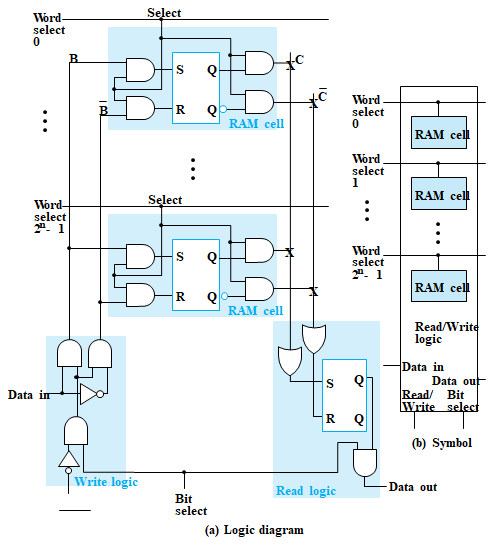

内存操作基本要求：每次只对一位进行操作，因此每次word select使能一位，然后将最后得到结果取或

3. $2^n$-Word $\times$ 1-Bit RAM IC:

- Decoder: decodes the n address lines to $2^n$ word select lines
- A 3-state buffer on the data output permits RAM ICs to be combined into a RAM with $c \times 2^n$ words

4. Coincident Selection:行列译码
   - Word select becomes Row select
   - Bit select becomes Column select

如1001，10使能row 2，01使能column 1

- $8\times2$RAM,一次操作两位

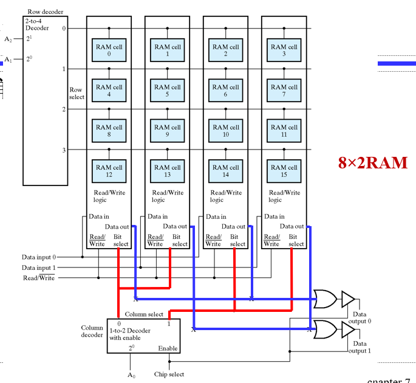

5. Making Larger Memories：把$4\times n$变成$16\times n$
   - 自扩展，即输出的字宽没变。高位选择RAM芯片，其余三态门输出为高阻态

6. Making Wider Memories：增加位宽，每块 RAM 芯片就代表最后输出的某一位，将地址线和控制线并行连接。

### Dynamic RAM 同步

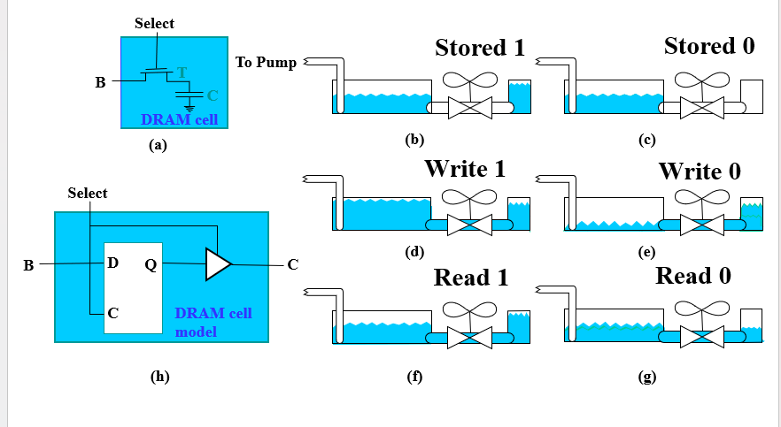

- Read:大容器初始置为已知中间水位。若小容器1，大容器由于水位比小容器低，会微微上升，可以认为读了1；若小容器0，大容器水位比小容器高，会微微下降，认为是读了0
  - 在这个操作中，外部容器变化不会很大，但足以检测到，但是小容器中原本存储的数据被破坏，因此要进行恢复
  - 恢复1：水泵将大容器注满，之后通过阀门
  - 恢复0：水泵排空大容器
- 对实际存储单元，还有其他电荷流动路径，可以理解为存储容器上的小孔(leak)，使得容器水位下降到一定水平，使得即使存储了1，打开阀门后大容器水位不仅没有可观测变化，甚至还可能下降，因此我们需要周期性填满存储值为1的小容器，该操作称为存储单元的刷新。

写数据时直接充放电即可；读取时，需要有电路判断电压高低，这时会消耗电荷,要将破坏性读转为非破坏性（将值写回去）

1. Bit Slice:检测放大器用于将 C 上的微小电压变化更改为 H 或 L，连接B、C和检测放大器输出，使破坏性读取转换为非破坏性读取

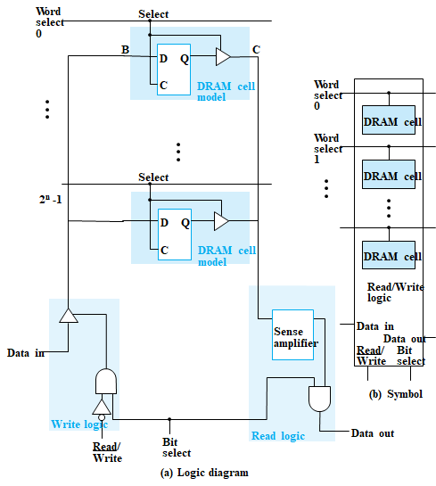

2. 需要做定时刷新（电容会自己放电） - Refresh Controller and Refresh Counter
3. 分别输入行地址、列地址（实际上是一组引脚，只是被 DRAM 分开输入），对应 $\overline{RAS},\overline{CAS}$（控制引脚，告诉芯片现在输入的是行/列地址）

4. read时序：行地址寄存器读入，列地址计数器读入，地址分两次输入。所选行所有位都被重新存储了一遍

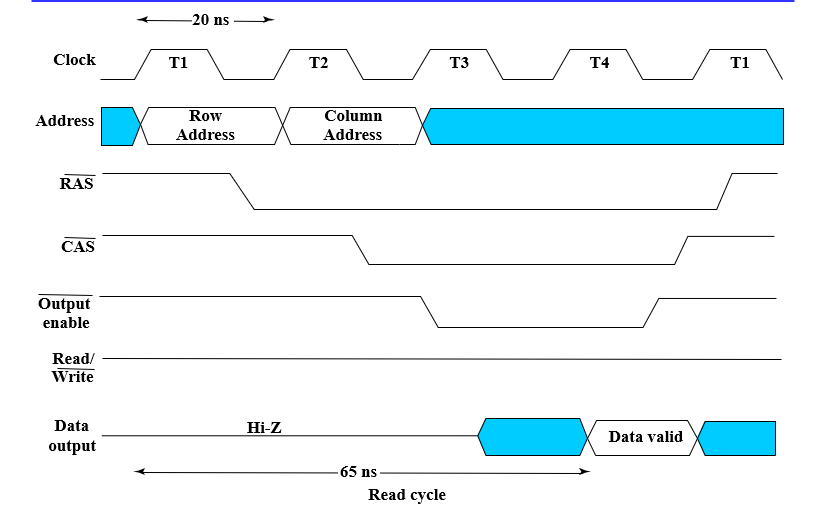

5. write：在写操作，所选行其他没有被选中的单元将原来存储值又存储了一次；read变0后，数据在列地址选择时间相同的时间间隔内有效

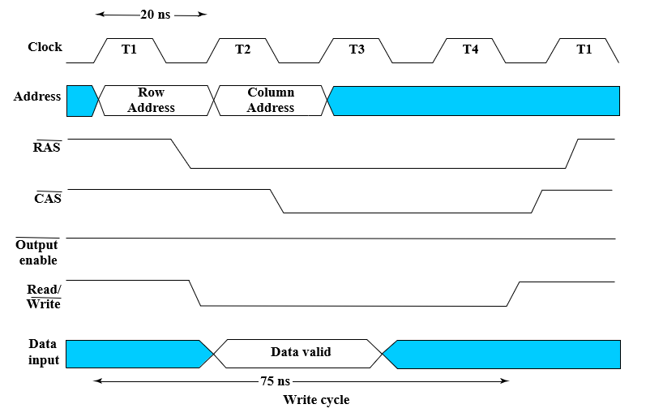

6. types

   - Synchronous DRAM (SDRAM) 随系统时钟

     - 用于寻址每个时钟周期要传输的内部数据
     - 一次可以读出多个数据 beginning with the column address counts up to column address + burst size – 1
     - **burst size=4** 极速读长度：输出字节的数量

     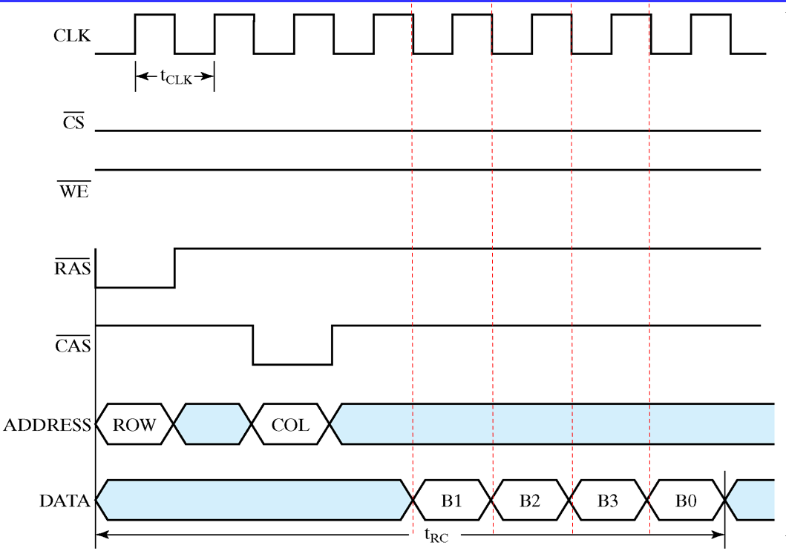

     - 计算例子

     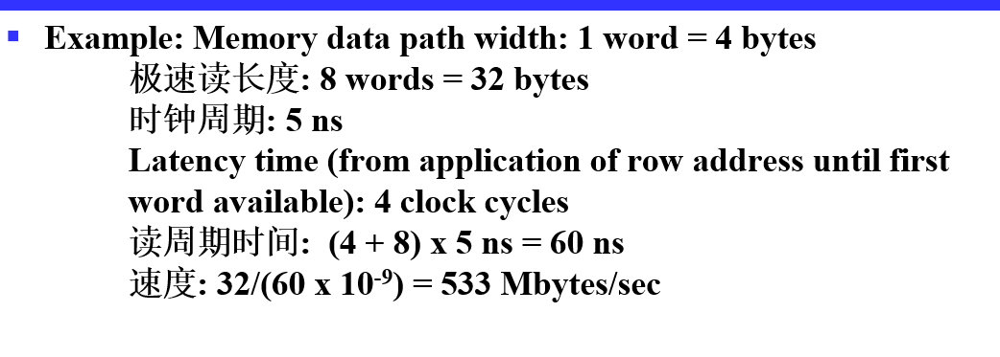

   - Double Data Rate SDRAM (DDR SDRAM) 上升沿和下降沿都可以进行一次操作，提升一倍吞吐量

   - RAMBUS® DRAM (RDRAM)

7. DRAM读取耗时长

8. 由于列地址每个周期需要加1，因此列地址使用计数器访问，为传输提供连续的列地址